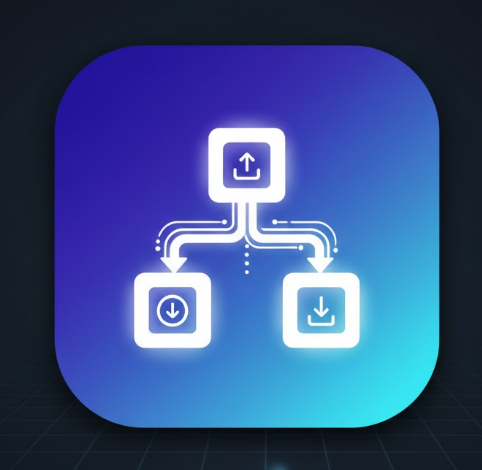
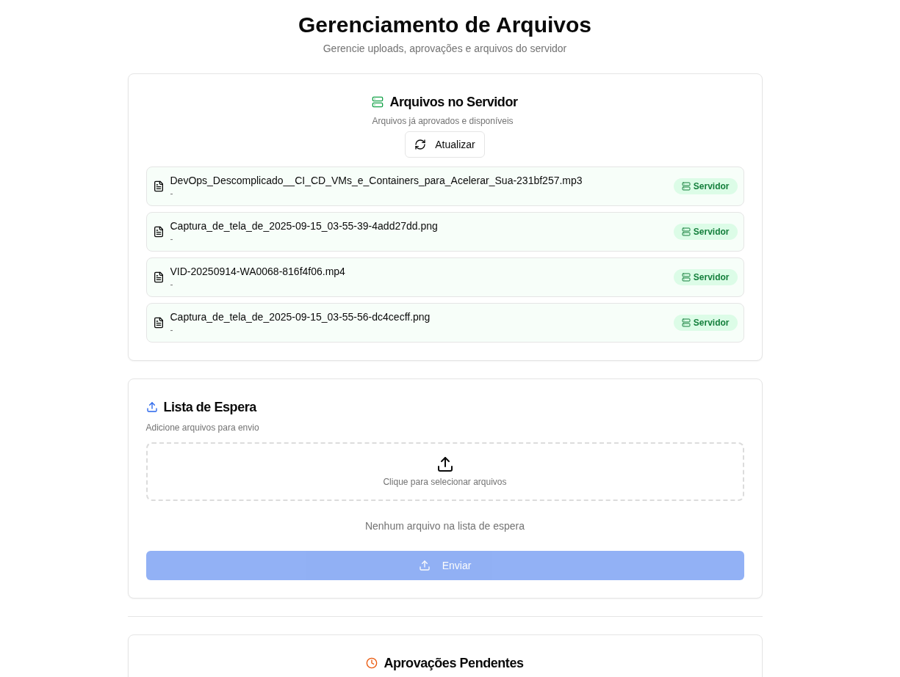
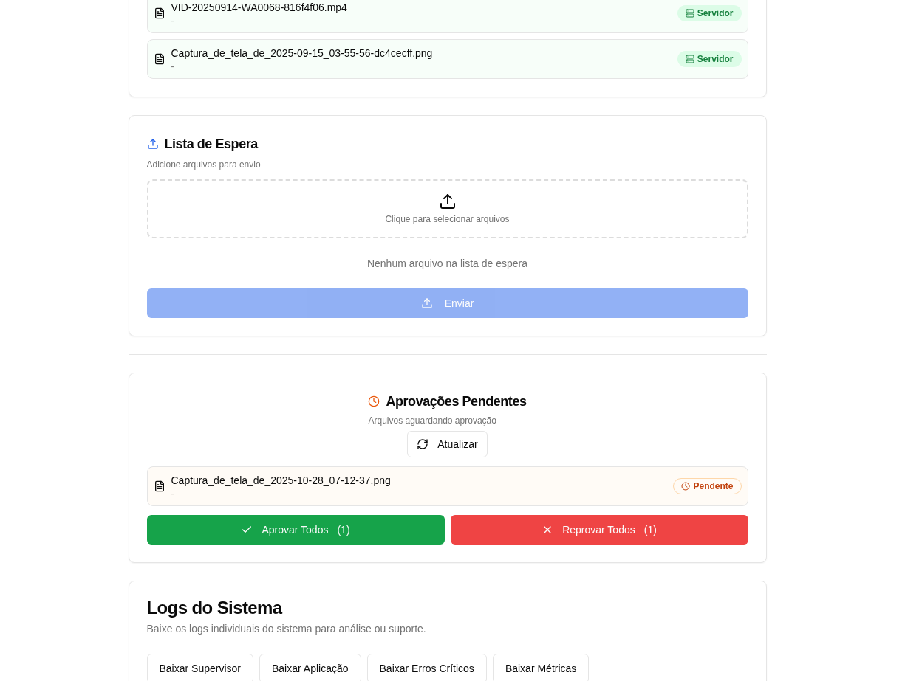
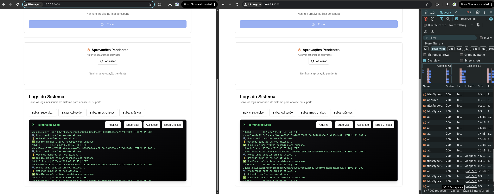

<p align="center">

</p>

<h1 align="center">ChainTransfer</h1>

<p align="center">
  <b>Aplicação de transferência de arquivos DTN/mesh para pesquisa científica.</b><br>
  <i>Desenvolvido para redes tolerantes a atrasos e monitoramento robusto.</i>
</p>

<p align="center">

    
    
    
    
</p>

ChainTransfer é uma aplicação de transferência de arquivos baseada em redes DTN (Delay-Tolerant Networking) e mesh, desenvolvida para pesquisa científica. Permite o envio e recebimento de arquivos entre nós de rede, com monitoramento robusto, logs detalhados e métricas de desempenho.

## Funcionalidades

- **Transferência de Arquivos**: Envio e recebimento de arquivos entre nós ativos na rede mesh.
- **Monitoramento e Logs**: Sistema de logs estruturados (supervisor, aplicação, erros críticos) com preview e download via interface web.
- **Métricas Científicas**: Registro automático de métricas de envio/recebimento (latência, taxa de transferência, tentativas, resultados) em formato CSV para análise de pesquisa.
- **Interface Web**: Frontend responsivo em React/Next.js para gerenciamento de arquivos, aprovações e visualização de logs.
- **Supervisor de Execução**: Script `run_supervisor.sh` para controle completo (start/stop/status), com opção de instalação como serviço systemd para inicialização automática.
- **Robustez Operacional**: Verificação automática de permissões, criação de diretórios necessários e tratamento de erros críticos.
- **Modularidade**: Backend Flask com blueprints, serviços reutilizáveis e rotinas de background.

## Estrutura do Projeto

```
ChainTransfer/
├── app.py                          # Ponto de entrada Flask, criação da app e rotinas
├── controllers/                    # Blueprints Flask (file, bundle, logs, metrics, etc.)
├── services/                       # Lógica de negócio (download, metrics, network, routines)
├── database/                       # Migração e persistência (SQLite)
├── logs/                           # Arquivos de log e métricas (supervisor.log, app.txt, metrics_envio.csv)
├── media_data/                     # Arquivos recebidos/armazenados (após aprovação)
├── upload_files/                   # Área de upload temporário (arquivos pendentes de aprovação)
├── interface-file-management/      # Frontend React/Next.js (código fonte)
│   ├── components/                 # Componentes UI (LogTerminal, etc.)
│   ├── app/                        # Páginas Next.js
│   └── package.json                # Dependências frontend
├── static_frontend/                # Build do frontend copiado para servir via Flask (site acessível)
├── run_supervisor.sh               # Script de gerenciamento (start/stop/init/rminit/build-frontend)
├── requirements.txt                # Dependências Python
└── README.md                       # Este arquivo
```

### Localização do Site (Interface Web)

- **Código Fonte**: `interface-file-management/` - Projeto Next.js/React com componentes responsivos, terminal de logs e botões de download.
- **Site Acessível**: Após build, os arquivos são copiados para `static_frontend/_next/` e servidos pelo Flask em `/` (ex.: `http://localhost:3000`). O Flask serve o `static_frontend/index.html` como página principal.

### Diretório de Transferência de Dados

- **upload_files/**: Diretório temporário onde arquivos enviados são armazenados antes da aprovação. Tipos suportados: qualquer arquivo (imagens, vídeos, documentos, etc.), limitado a 2 GiB por upload.
- **media_data/**: Diretório final onde arquivos aprovados são movidos e ficam disponíveis para download. Tipos: mesmos de upload_files, organizados por hash único para evitar conflitos.

## Instalação

### Pré-requisitos

- Python 3.8+
- Node.js 16+ (para frontend)
- Sistema Linux (para systemd, opcional)

### Backend

1. Clone o repositório:

   ```bash
   git clone https://github.com/PIC-projeto-Humanidades/ChainTransfer.git
   cd ChainTransfer
   ```

2. Instale dependências Python:

   ```bash
   pip install -r requirements.txt
   ```

3. Configure o banco de dados:

   ```bash
   python -c "from database.migrator import create_tables; create_tables()"
   ```

### Frontend

1. Entre no diretório do frontend:

   ```bash
   cd interface-file-management
   ```

2. Instale dependências:

   ```bash
   npm install
   # ou
   pnpm install
   ```

3. Build o frontend:

   ```bash
   npm run build
   # ou
   pnpm build
   ```

4. Copie o build para o backend (ou use o supervisor):

   ```bash
   ./run_supervisor.sh -build-frontend
   ```

### Configuração da Rede Mesh

Antes de executar a aplicação, configure o arquivo `network_config.json` para cada nó da rede mesh. Cada dispositivo deve ter um IP único e ser listado no router:

```json
{
  "ssid": "MESH_NET",
  "password": "meshPassword",
  "meu_ip": "10.0.0.3",
  "prefixo": 28,
  "gateway": "10.0.0.1",
  "dns": ["8.8.8.8", "1.1.1.1"],
  "routes": [
    { "node": "node-A", "ip": "10.0.0.2" },
    { "node": "node-B", "ip": "10.0.0.3" }
  ]
}
```

**Importante:**

- Cada dispositivo/nó deve ter um `"meu_ip"` diferente
- Todos os nós devem ser listados no array `"routes"` com seus respectivos IPs
- Configure o SSID e senha da rede mesh conforme sua infraestrutura

## Execução

### Método Principal: Usando o Supervisor

O script `run_supervisor.sh` é o método recomendado para executar a aplicação em produção, gerenciando todos os componentes automaticamente:

- **Iniciar**: `./run_supervisor.sh -start`
- **Parar**: `./run_supervisor.sh -stop`
- **Status**: `./run_supervisor.sh -status`
- **Instalar como serviço systemd**: `./run_supervisor.sh -init`
- **Remover serviço**: `./run_supervisor.sh -rminit`
- **Build e copiar frontend**: `./run_supervisor.sh -build-frontend`

### Modo Desenvolvimento

Para desenvolvimento e testes locais, você pode executar os componentes separadamente:

1. Execute o backend:

   ```bash
   python app.py
   ```

   - Acesse em `http://[IP-DA-MAQUINA]:3000`

2. Execute o frontend separadamente (opcional):

   ```bash
   cd interface-file-management
   npm run dev
   ```

### Modos Especiais

- Apenas API: `python app.py --only-api`
- Apenas rotinas: `python app.py --only-routine`

### Interface Web

A interface de transferência está acessível em `http://[IP-DA-MAQUINA]:3000` e oferece as seguintes funcionalidades:

#### Gerenciamento de Arquivos

- **Arquivos Existentes no Servidor**: Visualize todos os arquivos já armazenados e disponíveis para download
  
- **Área de Stage para Transferência**: Gerencie arquivos pendentes de aprovação antes da transferência final
  

#### Monitoramento e Logs

- **Acompanhamento de Logs em Tempo Real**: Terminal integrado para acompanhar logs do sistema
  
- **Download de Arquivos de Log**: Baixe logs completos (supervisor, aplicação, erros críticos)

#### Métricas Científicas

- **CSV de Métricas**: Baixe dados de métricas para análise científica (latência, taxa de transferência, tentativas, resultados)

### Transferência de Arquivos

- Arquivos enviados são colocados em `upload_files/` para aprovação.
- Após aprovação, movidos para `media_data/` e disponíveis para download.
- Métricas são registradas automaticamente em `logs/metrics_envio.csv`.

### Logs e Monitoramento

- Logs em `logs/app.txt`, `logs/supervisor.log`, `logs/critical_errors.txt`.
- Preview via `/preview-log/<tipo>` (supervisor, app, critical, all).
- Download via `/download-log/<tipo>`.

## Arquitetura

- **Backend (Flask)**: API REST com blueprints modulares, rotinas de background em threads, persistência SQLite.
- **Frontend (React/Next.js)**: Interface responsiva, terminal de logs, downloads via fetch+Blob.
- **Rotinas**: Descoberta periódica de bundles/nós, transferência automática, monitoramento de saúde.
- **Observabilidade**: Logs estruturados, métricas CSV, tratamento de erros críticos.
- **Segurança**: CORS configurado, validação de paths, permissões de arquivos.

## Contribuição

1. Fork o projeto.

2. Crie uma branch para sua feature: `git checkout -b feature/nova-funcionalidade`.

3. Commit suas mudanças: `git commit -m 'Adiciona nova funcionalidade'`.

4. Push para a branch: `git push origin feature/nova-funcionalidade`.

5. Abra um Pull Request.

### Diretrizes

- Use blueprints para novas rotas.
- Registre métricas em `services/metrics_service.py` para novos eventos.
- Teste logs e permissões.
- Atualize este README para novas funcionalidades.

## Licença

Este projeto é licenciado sob a MIT License - veja o arquivo LICENSE para detalhes.

## Contato

Para dúvidas ou contribuições, abra uma issue no GitHub ou entre em contato com a equipe do projeto PIC-projeto-Humanidades.
